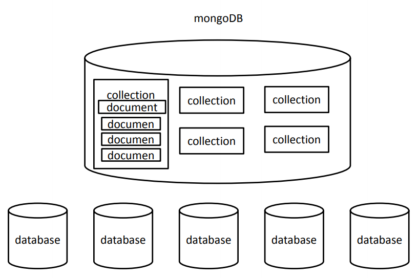
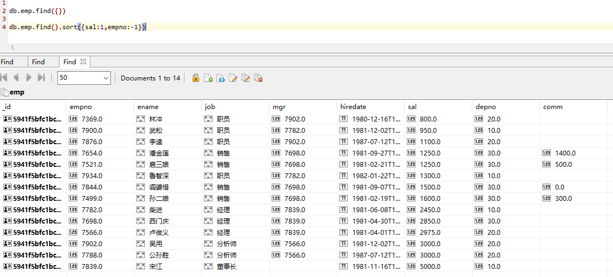
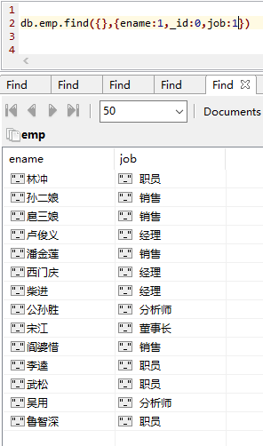

# MongoDB

## 简介

​	MongoDB是为快速开发互联网Web应用 而设计的数据库系统。 

​	MongoDB的设计目标是极简、灵活、作为 Web应用栈的一部分。 	

​	MongoDB的数据模型是面向文档的，所谓 文档是一种类似于JSON的结构，简单理解 MongoDB这个数据库中存的是各种各样的 JSON。（**BSON—binary json**） 

## 命令 

`mongod --dbpath 路径 --port 端口号`  ：启动MongoDB

`mongo`	: 连接MongoDB

`show dbs / databases` :  显示数据库

`use dbName` :  使用use时，如果数据库存在则会进入到相应的数 据库，如果不存在则会自动创建 ; 一旦进入数据库，则可以使用db来引用当前库

`db` : 表示当前数据库 

```javascript
> show dbs

> use test

> db
```

### 插入查询

`db.collection.insert(document)` :  insert()可以用于向集合中添加一个或多个文档， 可以传递一个对象，或一个数组。 可以将对象或数组中的对象添加进集合中 ；添加时如果集合或数据库不存在，会**自动创建** ；插入的文档对象会**默认添加_id属性**，这个属性 对应一个唯一的id，是文档的唯一标识 

`db.collection.insertOne() / insertMany()`

`db.collection.find () ` : 查询该集合所有符合条件的文档

```javascript
> db.test.insertMany([
	{name:"Jose",age:32,gender:"man"},
	{name:"Mancy",age:33,gender:"woman"},
	{name:"Funck",age:21,gender:"man"}	
])
> ObjectId()

> db.test.find()

> db.test.find({name:"lov"})

> db.test.find({}).count()
```

### 修改删除

`db.collection.update()` : 可以在update()中传递两个参数，一个是查询 文档，一个是新的文档，这样符和条件的文档 将会被新文档所替换 ,update()的第三个参数，用来指定是否使用 upsert，默认为false ,update()的第四个参数，用来指定是否同时修 改多个文档，默认为false 

`db.collection.updateOne() / updateMany()`

`db.collection.remove()`  :  remove()可以用来移除指定文档对象 ,方法接收一个查询文档作为参数，只有符合条 件的文档才会被删除 

`db.collection.deleteOne() / deleteMany()`

`db.collection.drop`	: 删除集合 ,如果当前数据库只有一个集合，则数据库也删除

`db.dropDatabase()`	： 删除当前数据库

```javascript
> db.test.update(
	{name:"Maly"},
	{name:"Mancy"}	
)
> db.test.update(
	{name:"Maly"},
	{
	  $set:{name:"Mancy"}
	},
	{multi:true}	
)

> db.test.updateMany({name:"Mancy"},{
	$set: {name:"Maly"}
})

> db.test.remove(
	{age:32},
	true
)

> db.test.drop()
```

## 组成

**数据库（database）** ： 数据库是一个仓库，在仓库中可以存放集合。 

**集合（collection）** ： 集合类似于数组，在集合中可以存放文档。 

**文档（document）** ： 文档数据库中的最小单位，我们存储和操作的 内容都是文档。 

​	**文档（document）**，类似于JS中的对象，在MongoDB中每一条数 据都是一个文档 ；**集合（collection）** ，集合就是一组文档，也就是集合是用来存放文 档的 – 集合中存储的文档可以是各种各样的，没有格 式要求；**多个文档组成集合，多个集合组成数据库** 



## 修改器

​	使用update会将整个文档替换，但是大部 分情况下我们是不需要这么做的 ；如果只需要对文档中的一部分进行更新时， 可以使用更新修改器来进行 

### \$set、$unset 

​	$set用来指定一个字段的值，如果这个字 段不存在，则创建它 

​	$unset可以用来删除文档中一个不需要的字段， 用法和set类似 

```javascript
> db.test.updateMany({name:"Mancy"},{
	$set: {name:"Maly"}
})
```

### \$inc 

​	$inc用来增加已有键的值，或者该键不存 在那就创建一个 

​	$inc只能用于Number类型的值 

## 文档间关系

​	一对多，多对一，多对多

```javascript
//one to one:内嵌文档形式体现 ============================
db.wife.insert([
	{
	  name:"aaa",
	  husband:{
	    name:"bbb"
	 }
	},
	{
	  name:"ccc",
	  husband:{
	    name:"ddd"
	 }
	}
])
//one to many : 内嵌文档映射 ============================
db.user.insert([
	{username:"lov"	},
	{username:"jok"}
])
db.user.find()

db.order.insert([
	{
	  list:["aa","bb","cc"],
	  user_id:ObjectId("5c8e2301e1304e4409afea9b")
	},
	{
	  list:["dd","ee","ff"],
	  user_id:ObjectId("5c8e2301e1304e4409afea9c")
	}
])
db.order.find()
//查找一对多关系 user-order
//db.user.findOne({username:"lov"})
var user_id = db.user.findOne({username:"lov"})._id
//user_id
db.order.findOne({user_id: user_id})
//many to many ========================================
db.teacher.insert([
	{name:"AAA"},
	{name:"BBB"},
	{name:"CCC"}
])
db.teacher.find()

db.stud.insert([
	{
	  name:"jack",
	  tech_ids:[
	  	ObjectId("5c8e26dde1304e4409afeaa0"),
	  	ObjectId("5c8e26dde1304e4409afeaa1")
	  ]
	},
	{
	  name:"mancy",
	  tech_ids:[
	  	ObjectId("5c8e26dde1304e4409afeaa0"),
	  	ObjectId("5c8e26dde1304e4409afeaa2")
	  ]
	}
])
db.stud.find()
```

## sort&投影

### sort

​	查询文档时，默认按照_id的值进行排序（升序）

​	sort() 可以指定文档的排序的规则，sort() 需要传递一个对象来指定排序规则（1：升序，-1：降序）

​	limit 、skip、sort 可以以任意的顺序进行调用

​	`db.emp.find().sort({sal:1,empno:-1})`



### 投影

​	查询时，可以在第二个参数的位置设置查询的结果

​	1：显示，0：不显示

​	`db.emp.find({},{ename:1,_id:0,job:1})`



## Mongoose

​	之前我们都是通过shell来完成对数据库的各种操作的，在 开发中大部分时候我们都需要通过程序来完成对数据库的 操作 。而==Mongoose就是一个让我们可以通过Node来操作 MongoDB的模块==。 Mongoose是一个对象文档模型（ODM）库，它对 Node原生的MongoDB模块进行了进一步的优化封装， 并提供了更多的功能。在大多数情况下，它被用来把结构化的模式应用到一个 MongoDB集合，并提供了验证和类型转换等好处 

### 优点

- 可以为文档创建一个模式结构（Schema） 
- 可以对模型中的对象/文档进行验证 
- 数据可以通过类型转换转换为对象模型 
- 可以使用中间件来应用业务逻辑挂钩 
- 比Node原生的MongoDB驱动更容易 

### 新对象

​	mongoose中为提供了几个新的对象 

**Schema**(模式对象)  ：Schema对象定义约束了数据库中的文档结构 

**Model**  ：Model对象作为集合中的所有文档的表示，相当于 MongoDB数据库中的集合collection 

**Document**  ： Document表示集合中的具体文档，相当于集合中 的一个具体的文档 

### 连接MongoDB

**1、安装Mongoose**

`npm i mongoose --save`

**2、导入Mongoose**

`var mongoose = require("mongoose")`

**3、连接MongoDB数据库**

`mongoose.connect('mongodb://ip地址:port/数据库',{ useNewUrlParser: true })`	（端口是默认端口27017可以省略）

**4、断开数据库连接（一般不调用）**

​	MongoDB数据库一般只需要连接一次，之后除非项目停止服务器关闭，否则连接一般不会断开

`mongoose.disconnect()`

**5、监听MongoDB数据库的连接状态**

`mongoose.connection.once("open",function(){})` ：数据库连接成功事件

`mongoose.connection.once("close",function(){})` ： 数据库断开事件

```javascript
const mongoose = require('mongoose');
//连接数据库
mongoose.connect("mongodb://127.0.0.1/test",{ useNewUrlParser: true });

mongoose.connection.once("open",()=>{
	console.log("database connect success >>>>");
});

mongoose.connection.once("close",()=>{
	console.log("database been disconnect <<<<");
});
//断开连接
mongoose.disconnect();
```

### Connection

- 一旦连接了MongoDB数据库，底层的 Connection对象就可以通过mongoose模块 的conection属性来访问。 
- connection对象是对数据库连接的抽象，它 提供了对象连接、底层的Db对象和表示结合 的Model对象的访问。 
- 并且可以对connection对象上的一些事件进 行监听，来获悉数据库连接的开始与端开。 
- 比如，可以通过open和close事件来监控连接 的打开和关闭。 

### Schema & Model

#### 模式

- 模式为集合中的文档定义字段和字段类型。 
- 简单来说，模式就是对文档的约束，有了 模式，文档中的字段必须符合模式的规定。 否则将不能正常操作。 
- 受支持的类型： String \ Number \ Boolean \ Array \ Buffer \ Date \ ObjectId或Oid \ Mixed 

#### 创建模式

​	模式需要通过mongoose的Schema属性来 创建，这个属性是一个构造函数。

​	**new Schema(definition,option)** 

> definition（描述模式） 
>
> options 配置对象，定义与数据库中集合的交互 

​	**options常用选项** 

> **autoIndex** : 布尔值，开启自动索引，默认true
>
> **bufferCommands** : 布尔值，缓存由于连接问题无法执行的语句，默认true 
>
> **capped** : 集合中最大文档数量
>
> **collection** : 指定应用Schema的集合名称 
>
> **id** : 布尔值，是否有应用于_id的id处理器，默认true
>
> **_id** : 布尔值，是否自动分配id字段，默认true 
>
> **strict** : 布尔值，不符合Schema的对象不会被插入进数据库，默认true 

#### 模型

- 一旦定义好了Schema对象，就需要通过该 Schema对象来创建Model对象。 
- 一旦创建好了Model对象，就会自动和数据库中对应的集合建立连接，以确保在应用更改时，集合已经创建并具有适当的索引，且设置了必须性和唯一性。 
- Model对象就相当于数据库中的集合，通过Model可以完成对集合的CRUD操作。 

#### 创建模型

​	创建模型对象需要使用mongoose的model() 方法，语法如下

​	**model(name, [schema], [collection] , [skipInit])** 

> **name**参数相当于模型的名字，以后可以同过name找到模型。
>
> **schema**是创建好的模式对象。 
>
> **collection**是要连接的集合名。 
>
> **skipInit**是否跳过初始化，默认是false。 

​	一旦把一个Schema对象编译成一个Model对 象，就完全准备好开始在模型中访问、添加、 删除、更新和删除文档了。也就是说有了模型后就可以操作数据库了 

#### Model方法

> remove(conditions, callback) 
>
> deleteOne(conditions, callback) 
>
> deleteMany(conditions, callback) 
>
> find(conditions, projection, options, callback) 
>
> findById(id, projection, options, callback) 
>
> findOne(conditions, projection, options, callback) 
>
> count(conditions, callback) 
>
> create(doc, callback) 
>
> update(conditions, doc, options, callback) 

```javascript
const mongoose = require('mongoose');

//将mongoose.Schema赋值给一个变量
const Schema = mongoose.Schema;

//连接mongodb
mongoose.connect("mongodb://127.0.0.1/test",{ useNewUrlParser: true });
//连接事件
mongoose.connection.once("open",()=>{
	console.log("database connect success >>>>");
});
//关闭事件
mongoose.connection.once("close",()=>{
	console.log("database been disconnect <<<<");
});

//创建Schema对象
var stuSchema = new Schema({
	name:String,
	age:Number,
	gender:{
		type:String,
		default:"male"
	} //默认值为male
});
/*
	通过Schema来创建Model
	Model代表的是数据库中的集合，通过Model才能对数据库进行操作
	mongoose.model(modelName,schema)
	modelName是映射的集合名，mongoose会自动将集合名变为复数
*/
var StuModel = mongoose.model("student",stuSchema);

/*
	Model.create(doc(s),[callback])
	创建一个文档并添加到数据库
*/
StuModel.create([{
	name:"jjj",
	age:99,
	gender:"male"
},{
	name:"ggg",
	age:100,
	gender:"female"
}],(err)=>{
	if (!err) {
		console.log(arguments);
		console.log("create success ---")
	}
})

// mongoose.disconnect();
```

### Document

- 通过Model对数据库进行查询时，会返回 Document对象或Document对象数组。 
- Document继承自Model，代表一个集合 中的文档。 
- Document对象也可以和数据库进行交互 操作 

#### Document方法

> equals(doc) 
>
> id 
>
> get(path,[type]) 
>
> set(path,value,[type]) 
>
> update(update,[options],[callback]) 
>
> save([callback]) 
>
> remove([callback]) 
>
> isNew 
>
> isInit(path) 
>
> toJSON() 
>
> toObject() 

```javascript
const mongoose = require('mongoose');

const Schema = mongoose.Schema;

mongoose.connect("mongodb://127.0.0.1/test",{ useNewUrlParser: true });
mongoose.connection.once("open",()=>{
	console.log("database connect success >>>>");
});

mongoose.connection.once("close",()=>{
	console.log("database been disconnect <<<<");
});


var stuSchema = new Schema({
	name:String,
	age:Number,
	gender:{
		type:String,
		default:"male"
	} //默认值为male
});

var StuModel = mongoose.model("student",stuSchema);

//通过Model查询的结果都是Document

var stu = new StuModel({
	name:"lll",
	age:33,
	gender:"female"
});

console.log(stu);

// stu.save((err)=>{
// 	if (!err) {
// 		console.log('save success');
// 	}
// });

StuModel.findOne({},(err,doc)=>{
	if (!err) {

		/*
			update(update,[options],[callback])
			remove([callback])
		*/
		/*doc.update({$set:{age:88}},(err)=>{
			if (!err) {
				console.log('update success');
			}
		});*/

		/*doc.age = 11;
		doc.save（）;*/

		/*doc.remove((err)=>{
			if (!err) {
				console.log('remove success');
			}
		});*/

		/*
			get(name)	获取文档中的指定属性值
			set(name,value)	设置文档中的指定属性值
			id 	获取文档中的_id属性值
			toObject()	将document对象转换为一个普通js对象
					转换为普通js对象后，注意所有的document对象的方法或属性都不能使用
		*/

		console.log(doc.get("age"));
		console.log(doc.age);

		doc.set("name","NewName")
		console.log(doc);

		doc = doc.toObject();

		delete doc.age;
		console.log(doc);

	}
});
```